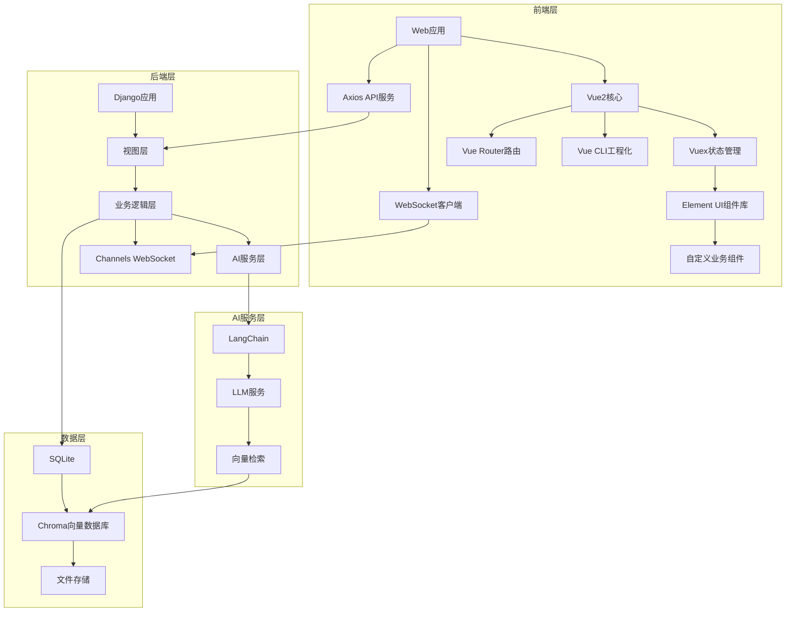
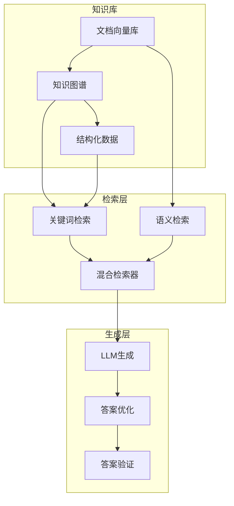

<h1 align = "center">系统设计</h1>  

## 1. 系统架构设计

### 1.1 整体架构


### 1.2 技术栈选型
1. 前端技术
   - 核心框架
      - Vue 2.7（Options API）
      - Vue Router 3.6
      - Vuex 3.6（状态管理）
   - UI框架
      - Element UI 2.15（基础组件库）
      - SCSS 1.32（样式预处理器）
      - Vue-Awesome 4.0（图标库）
   - 网络通信
      - Axios 0.21（REST API调用）
      - WebSocket（实时通信）
      - JWT认证（Token管理）
   - 工程化工具
      - Vue CLI 5.0（项目脚手架）
      - Webpack 5.0（构建工具）
      - Babel 7.0（ES6转译）
   
2. 后端技术
   - Django 4.2
   - Django REST framework（核心API）
   - Django Channels（WebSocket支持）
3. 数据存储
   - SQLite（开发阶段）
   - Chroma 向量数据库
   - 文件存储系统
4. AI技术
   - LangChain 框架
   - OpenAI/Gemini API
   - Sentence Transformers

## 2. 核心模块设计

### 2.1 文档处理模块
- 文档预处理
  - 格式转换
  - 文本清理
  - 元数据提取
- 文档管理
  - 版本控制
  - 访问权限
  - 存储管理

### 2.2 RAG引擎模块
- 对话管理
  - 多轮对话上下文
  - 会话状态管理
  - 用户意图识别
- 答案生成
  - 质量评估
  - 相关文档推荐
  - 用户反馈处理

### 2.3 测验生成模块
- 题目生成
  - 难度级别控制
  - 知识点标签
  - 题型管理
- 学习跟踪
  - 错题分析
  - 进度跟踪
  - 知识点掌握度

### 2.4 对话管理模块
- 会话控制
  - 状态管理
  - 历史记录
  - 上下文维护
- 交互支持
  - 多模态交互
  - 实时响应
  - 历史导出

## 3. 数据模型设计

### 3.1 数据库模型
```python
# 核心模型
class Document(models.Model):
    title = models.CharField(max_length=200)
    content = models.TextField()
    file_path = models.CharField(max_length=500)
    metadata = models.JSONField()
    version = models.IntegerField(default=1)
    created_at = models.DateTimeField(auto_now_add=True)
    updated_at = models.DateTimeField(auto_now=True)

class Question(models.Model):
    QUESTION_TYPES = [
        ('MC', 'Multiple Choice'),
        ('TF', 'True/False'),
        ('FB', 'Fill in Blank'),
        ('SA', 'Short Answer')
    ]
    
    content = models.TextField()
    type = models.CharField(max_length=2, choices=QUESTION_TYPES)
    difficulty = models.IntegerField()
    knowledge_points = models.JSONField()
    options = models.JSONField(null=True)
    answer = models.TextField()
    explanation = models.TextField()
    document = models.ForeignKey(Document, on_delete=models.CASCADE)

class Conversation(models.Model):
    user = models.ForeignKey(User, on_delete=models.CASCADE)
    mode = models.CharField(max_length=20)
    context = models.JSONField()
    created_at = models.DateTimeField(auto_now_add=True)
    
class Message(models.Model):
    conversation = models.ForeignKey(Conversation, on_delete=models.CASCADE)
    content = models.TextField()
    is_user = models.BooleanField()
    feedback = models.IntegerField(null=True)
    created_at = models.DateTimeField(auto_now_add=True)
```

## 4. API设计

### 4.1 RESTful API
1. 文档管理
   - POST /api/documents/upload
     - 文件类型验证
     - 大小限制
     - 元数据提取
   - GET /api/documents/
     - 分页
     - 过滤
     - 排序
   - DELETE /api/documents/{id}
   - PUT /api/documents/{id}
   - GET /api/documents/{id}/metadata

2. 对话接口
   - POST /api/chat/
     - 上下文参数
     - 模式选择
   - GET /api/chat/history
     - 时间范围
     - 分页
   - DELETE /api/chat/{id}
   - POST /api/chat/feedback

3. 测验接口
   - POST /api/quiz/generate
     - 难度参数
     - 题型选择
   - POST /api/quiz/submit
     - 答题时间
     - 正确性
   - GET /api/quiz/history
   - GET /api/quiz/analysis

4. 用户接口
   - POST /api/users/register
   - POST /api/users/login
   - GET /api/users/profile
   - PUT /api/users/settings

### 4.2 WebSocket API
- ws://host/ws/chat/
  - 心跳检测
  - 重连机制
- ws://host/ws/quiz/
  - 实时测验
  - 进度同步
- ws://host/ws/notification/
  - 系统通知
  - 状态更新

## 5. 安全设计（后续开发）

### 5.1 接口安全
- 请求频率限制
- 参数验证
- 错误处理
- 日志记录

### 5.2 数据安全
- 文档访问控制
- 数据加密存储
- 敏感信息脱敏
- 操作审计日志

## 6. 性能优化（后续开发）

### 6.1 缓存策略
- 文档缓存
- 向量检索缓存
- 会话状态缓存
- 静态资源缓存

### 6.2 并发处理
- 异步任务处理
- 批量文档处理
- 并发请求控制
- 资源池管理

## 7. 部署架构（后续开发）

### 7.1 开发环境
```
+------------------+
|   开发环境配置   |
+------------------+
| Python 3.9+      |
| SQLite           |
| ChromaDB         |
+------------------+
```

### 7.2 生产环境
```
+------------------+     +------------------+
|   负载均衡器     |     |   应用服务器    |
|    Nginx         | --> |    Gunicorn     |
+------------------+     +------------------+
        |                       |
        v                       v
+------------------+     +------------------+
|   数据库服务器   |     |   文件存储      |
|   PostgreSQL     |     |   文件系统      |
+------------------+     +------------------+
```

## 8. 混合RAG实现设计

### 8.1 混合RAG架构


### 8.2 核心组件

#### 8.2.1 混合检索器
- 关键词检索
  - 基于TF-IDF的文本匹配
  - 基于知识图谱的实体检索
  - 基于结构化数据的精确匹配

- 语义检索
  - 基于向量相似度的语义匹配
  - 基于文档结构的上下文检索
  - 基于知识图谱的语义扩展

#### 8.2.2 知识库构建
- 文档向量化
  - 文本分块策略
  - 向量编码方法
  - 元数据提取

- 知识图谱
  - 实体识别
  - 关系抽取
  - 图谱构建

- 结构化数据
  - 表格数据提取
  - 列表数据提取
  - 数据规范化

#### 8.2.3 答案生成
- 提示词工程
  - 上下文组装
  - 指令设计
  - 约束条件

- 答案优化
  - 答案格式化
  - 引用溯源
  - 置信度评估

### 8.3 实现流程

1. 文档处理阶段
   ```
   原始文档 -> 文本提取 -> 分块处理 -> 向量化 -> 知识提取 -> 知识库构建
   ```

2. 检索阶段
   ```
   用户问题 -> 问题分析 -> 混合检索 -> 相关文档 -> 知识融合
   ```

3. 生成阶段
   ```
   知识融合 -> 提示词构建 -> LLM生成 -> 答案优化 -> 结果输出
   ```

### 8.4 关键算法

#### 8.4.1 混合检索算法
```python
class HybridRetriever:
    def __init__(self):
        self.keyword_retriever = KeywordRetriever()
        self.semantic_retriever = SemanticRetriever()
        self.knowledge_retriever = KnowledgeRetriever()
    
    def retrieve(self, query):
        # 1. 并行检索
        keyword_results = self.keyword_retriever.search(query)
        semantic_results = self.semantic_retriever.search(query)
        knowledge_results = self.knowledge_retriever.search(query)
        
        # 2. 结果融合
        merged_results = self.merge_results(
            keyword_results,
            semantic_results,
            knowledge_results
        )
        
        # 3. 重排序
        reranked_results = self.rerank(merged_results)
        
        return reranked_results
```

#### 8.4.2 知识融合算法
```python
class KnowledgeFusion:
    def __init__(self):
        self.vector_store = Chroma()
        self.knowledge_graph = KnowledgeGraph()
    
    def fuse(self, retrieved_docs):
        # 1. 文档对齐
        aligned_docs = self.align_documents(retrieved_docs)
        
        # 2. 知识补充
        enriched_docs = self.enrich_knowledge(aligned_docs)
        
        # 3. 冲突解决
        resolved_docs = self.resolve_conflicts(enriched_docs)
        
        return resolved_docs
```

### 8.5 优化策略

#### 8.5.1 检索优化
- 动态权重调整
- 上下文感知检索
- 多粒度检索

#### 8.5.2 生成优化
- 答案模板化
- 多轮对话优化
- 答案质量评估

#### 8.5.3 性能优化
- 缓存机制
- 并行处理
- 增量更新

### 8.6 评估指标

#### 8.6.1 检索评估
- 召回率
- 准确率
- 响应时间

#### 8.6.2 生成评估
- 答案相关性
- 答案完整性
- 答案准确性

#### 8.6.3 系统评估
- 用户满意度
- 系统响应时间
- 资源利用率
